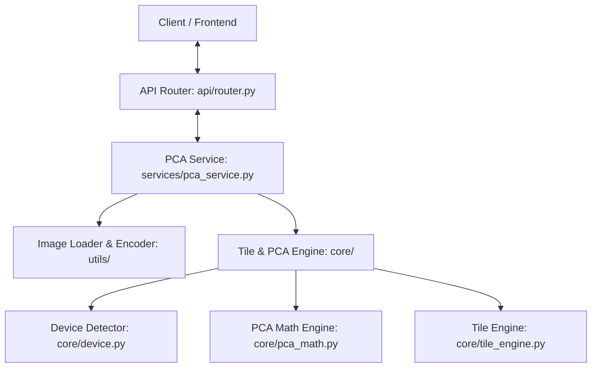

# 🖼️ Image Compression Backend (PCA-based)

[](https://fastapi.tiangolo.com)
[](https://pytorch.org)
[](https://www.python.org)

Backend API berbasis FastAPI yang kuat dan berkinerja tinggi untuk mengompresi gambar menggunakan metode **Principal Component Analysis (PCA)**. Dilengkapi dengan mesin pemrosesan ubin adaptif (*adaptive tile-based engine*) untuk menangani gambar beresolusi sangat besar tanpa mengalami kehabisan memori (*Out Of Memory*), serta mendukung akselerasi otomatis perangkat keras (CPU, CUDA GPU, dan Apple Silicon MPS).

---

## 📌 Daftar Isi
- [📖 Deskripsi Proyek](#-deskripsi-proyek)
- [✨ Fitur Utama](#-fitur-utama)
- [🏗️ Arsitektur Proyek](#%EF%B8%8F-arsitektur-proyek)
- [📂 Struktur Proyek](#-struktur-proyek)
- [⚙️ Cara Kerja Sistem](#%EF%B8%8F-cara-kerja-sistem)
- [🚀 Instalasi & Menjalankan](#-instalasi--menjalankan)
  - [Prasyarat Sistem](#prasyarat-sistem)
  - [Langkah Instalasi](#langkah-instalasi)
  - [Instalasi PyTorch Khusus Akselerasi Hardware](#instalasi-pytorch-khusus-akselerasi-hardware)
  - [Menjalankan Server](#menjalankan-server)
- [📖 Panduan Penggunaan](#-panduan-penggunaan)
  - [Interaksi lewat Swagger UI](#interaksi-lewat-swagger-ui)
  - [Spesifikasi Endpoint API](#spesifikasi-endpoint-api)
- [🔬 Detail Teknis](#-detail-teknis)
  - [Matematika PCA & SVD](#matematika-pca--svd)
  - [Penyusunan Ubin Adaptif (Adaptive Tiling)](#penyusunan-ubin-adaptif-adaptive-tiling)
  - [Manajemen Batch Adaptif](#manajemen-batch-adaptif)
- [👥 Anggota Kelompok](#-anggota-kelompok)

---

## 📖 Deskripsi Proyek

Proyek **Image Compression Backend** dirancang untuk menyediakan layanan kompresi citra berbasis algoritma reduksi dimensi Principal Component Analysis (PCA). Dalam pemrosesan gambar konvensional, melakukan PCA/SVD secara langsung pada gambar beresolusi tinggi (misal: 4K atau 8K) sangat memakan memori dan rentan mengalami *Out of Memory* (OOM). 

Untuk mengatasi batasan tersebut, backend ini menggunakan pendekatan **Adaptive Tile-based Processing**. Citra masukan dipecah secara adaptif menjadi ubin-ubin (*tiles*) yang tumpang tindih (*overlap*), diproses secara paralel/batch menggunakan akselerasi tensor PyTorch, kemudian disatukan kembali secara mulus dengan teknik *weighted blending*. Hal ini menjamin konsumsi memori tetap stabil dan proses kompresi berjalan sangat cepat.

---

## ✨ Fitur Utama

Sistem ini memiliki berbagai fitur canggih dan modular:
* **PCA-based image compression**: Kompresi citra berkualitas tinggi memanfaatkan pengurangan dimensi dengan mempertahankan *singular values* dominan.
* **Adaptive tile-based processing for large images**: Pembagian citra resolusi tinggi secara otomatis menjadi ubin-ubin kecil guna mencegah lonjakan penggunaan memori.
* **Modular architecture**: Pemisahan yang bersih antara layer API, logika bisnis (Services), fungsi matematika/pemrosesan (Core), dan komponen pembantu (Utilities).
* **FastAPI REST API**: Endpoint berkinerja tinggi, dilengkapi penanganan kesalahan (*error handling*) dan validasi skema otomatis.
* **Automatic CPU/GPU device detection**: Pendeteksian otomatis perangkat komputasi terbaik yang terpasang pada mesin server.
* **Optional CUDA acceleration (NVIDIA)**: Pemanfaatan akselerasi GPU NVIDIA menggunakan CUDA untuk meningkatkan kecepatan kompresi berkali-kali lipat.
* **Apple Silicon (MPS) support**: Integrasi penuh dengan chip Apple (M1/M2/M3/dst.) menggunakan Metal Performance Shaders (MPS).
* **CPU fallback for unsupported hardware**: Penanganan *fallback* otomatis ke CPU secara mulus apabila tidak terdeteksi akselerasi GPU atau MPS.
* **Support for JPEG, PNG, BMP, TIFF, HEIC, and RAW images**: Kompatibilitas luas terhadap berbagai jenis berkas masukan, termasuk foto RAW langsung dari kamera profesional serta format HEIC dari perangkat iOS.
* **Automatic tile size selection**: Ukuran ubin pemrosesan dihitung secara dinamis menyesuaikan resolusi gambar demi hasil visual dan performa yang optimal.
* **Adaptive batch processing**: Penentuan kapasitas pemrosesan paralel (*batch size*) ubin secara adaptif bergantung pada total VRAM GPU yang tersedia.
* **Interactive Swagger API documentation**: Penyediaan UI interaktif untuk mencoba endpoint kompresi langsung melalui peramban.

---

## 🏗️ Arsitektur Proyek

Arsitektur aplikasi terbagi menjadi 4 lapisan utama untuk menjaga kode tetap bersih (*clean code*) dan mudah dikembangkan:



1. **API Layer ([src/api/router.py](file:///c:/Users/ASUS/Documents/Github/image-compression-backend/src/api/router.py))**: Menangani request HTTP POST, memvalidasi parameter input (jumlah komponen PCA dan keberadaan file), serta mengembalikan data JSON.
2. **Service Layer ([src/services/pca_service.py](file:///c:/Users/ASUS/Documents/Github/image-compression-backend/src/services/pca_service.py))**: Logika alur kompresi utama yang mengintegrasikan pemisahan ubin, pengiriman data ke modul matematika PCA, penggabungan ubin, pengodean hasil kompresi, dan kalkulasi statistik (ukuran berkas, persentase distorsi piksel, waktu proses).
3. **Core Engine ([src/core/](file:///c:/Users/ASUS/Documents/Github/image-compression-backend/src/core))**:
   - [device.py](file:///c:/Users/ASUS/Documents/Github/image-compression-backend/src/core/device.py): Mengidentifikasi perangkat keras terbaik (CUDA GPU, MPS, atau CPU).
   - [pca_math.py](file:///c:/Users/ASUS/Documents/Github/image-compression-backend/src/core/pca_math.py): Operasi SVD (*Singular Value Decomposition*) dan rekonstruksi citra menggunakan tensor PyTorch.
   - [tile_engine.py](file:///c:/Users/ASUS/Documents/Github/image-compression-backend/src/core/tile_engine.py): Membagi gambar ke ubin tumpang tindih (*overlapping*), menentukan batch size & tile size secara dinamis, dan menggabungkan kembali ubin dengan teknik *blending* untuk menghilangkan garis sambungan (*seam lines*).
4. **Utilities ([src/utils/](file:///c:/Users/ASUS/Documents/Github/image-compression-backend/src/utils))**:
   - [image_loader.py](file:///c:/Users/ASUS/Documents/Github/image-compression-backend/src/utils/image_loader.py): Membaca berbagai format berkas gambar dan mengubahnya menjadi format standar matriks RGB NumPy.
   - [image_encoder.py](file:///c:/Users/ASUS/Documents/Github/image-compression-backend/src/utils/image_encoder.py): Mengodekan kembali matriks RGB NumPy hasil kompresi menjadi format JPEG Base64 yang siap ditransmisikan.
   - [image_utils.py](file:///c:/Users/ASUS/Documents/Github/image-compression-backend/src/utils/image_utils.py): Validasi struktur nama berkas dan ekstensi input.

---

## 📂 Struktur Proyek

Berikut adalah tata letak folder dan berkas pada repositori ini:

```text
image-compression-backend/
├── src/
│   ├── api/
│   │   ├── __init__.py
│   │   └── router.py            # Routing endpoint API kompresi (/compress)
│   ├── core/
│   │   ├── __init__.py
│   │   ├── device.py            # Detektor hardware (CUDA, MPS, CPU)
│   │   ├── pca_math.py          # Logika matematika PCA/SVD berbasis PyTorch
│   │   └── tile_engine.py       # Algoritma partisi ubin dan penggabungan blending
│   ├── services/
│   │   ├── __init__.py
│   │   └── pca_service.py       # Orchestrator alur kompresi PCA
│   ├── utils/
│   │   ├── __init__.py
│   │   ├── image_encoder.py     # Encoder matriks gambar ke Base64 JPEG
│   │   ├── image_loader.py      # Pustaka pembaca citra (Pillow, RAW, HEIC)
│   │   └── image_utils.py       # Validasi masukan berkas gambar
│   ├── main.py                  # File utama inisialisasi FastAPI & Uvicorn
│   └── __init__.py
├── .gitignore
├── LICENSE
├── requirements.txt             # Dependensi utama aplikasi
└── README.md                    # Dokumentasi program (Berkas ini)
```

---

## ⚙️ Cara Kerja Sistem

Proses kompresi gambar pada sistem ini berjalan melalui tahapan terstruktur berikut:

```text
  [Gambar Masukan]
         │
         ▼
  [Load Gambar] ───► Konversi ke RGB NumPy (Mendukung HEIC & RAW)
         │
         ▼
  [Tile Engine] ───► Hitung dimensi ubin (512px - 2048px) secara adaptif
         │
         ▼
  [Batching] ──────► Bagi ubin ke beberapa batch sesuai VRAM
         │
         ▼
  [PCA Core] ──────► Konversi ke Torch Tensor, unggah ke GPU/CPU, lakukan SVD,
         │           rekonstruksi matriks berdasarkan nilai parameter 'components'
         │
         ▼
  [Merging] ───────► Satukan kembali ubin dengan weighted blending di area overlap
         │
         ▼
[JPEG Encoding] ───► Konversi ke Base64 string dengan kualitas kompresi JPEG 90%
         │
         ▼
  [JSON Response] ─► Kirim data Base64 serta statistik lengkap ke Client
```

1. **Pembacaan Berkas**: Gambar masukan dari *request* didekode menggunakan modul khusus di [image_loader.py](file:///c:/Users/ASUS/Documents/Github/image-compression-backend/src/utils/image_loader.py). Jika gambar dalam format *Camera RAW* (seperti `.cr2`, `.nef`, `.arw`), modul `rawpy` akan mengolahnya. Format `.heic` didekode menggunakan `pillow-heif`.
2. **Segmentasi Adaptif**: Gambar dipecah menjadi beberapa ubin (*tiles*) berukuran tetap berdasarkan resolusi terpanjangnya (ditangani oleh fungsi `select_tile_size` di [tile_engine.py](file:///c:/Users/ASUS/Documents/Github/image-compression-backend/src/core/tile_engine.py)):
   - Panjang $\le 2000\text{ px} \implies$ Ukuran ubin $512\text{ px}$.
   - Panjang $\le 5000\text{ px} \implies$ Ukuran ubin $1024\text{ px}$.
   - Panjang $\le 10000\text{ px} \implies$ Ukuran ubin $1536\text{ px}$.
   - Panjang $> 10000\text{ px} \implies$ Ukuran ubin $2048\text{ px}$.
   Setiap ubin dibuat memiliki tumpang tindih (*overlap*) sebesar $64\text{ px}$ dengan ubin tetangganya.
3. **Pengiriman Batch Adaptif**: Ubin-ubin dikelompokkan ke dalam ukuran batch komparatif untuk diproses bersama-sama:
   - Non-CUDA (CPU/MPS): *Batch size* diatur ke $1$ untuk menghemat memori RAM.
   - CUDA GPU: *Batch size* disesuaikan dengan kapasitas VRAM GPU ($<6\text{ GB} \implies 4$; $<10\text{ GB} \implies 8$; $<16\text{ GB} \implies 16$; $\ge 16\text{ GB} \implies 32$).
4. **Rekonstruksi PCA**: Batch tensor ubin dikonversi ke tipe data *float* dengan urutan dimensi $(N, C, H, W)$ lalu dipindahkan ke perangkat akselerasi (GPU/MPS/CPU). Operasi Singular Value Decomposition (SVD) memotong komponen singular sesuai masukan parameter `components`, lalu membangun kembali ubin yang telah terkompresi.
5. **Penyatuan Citra (Blending)**: Bagian overlap diisi dengan menjumlahkan nilai piksel dan membaginya dengan jumlah kontributor ubin pada koordinat tersebut (teknik rata-rata pembobotan) agar sambungan ubin tampak menyatu alami tanpa garis patah.
6. **Output**: Hasil akhir dikompresi ke JPEG dengan kualitas 90, kemudian dikonversi ke format teks Base64 untuk mempermudah transfer data di protokol web REST API.

---

## 🚀 Instalasi & Menjalankan

### Prasyarat Sistem
* **Python**: Versi `3.12` atau yang lebih baru.
* **RAM**: Minimal `8 GB` (Direkomendasikan `16 GB` untuk pemrosesan gambar resolusi ultra tinggi).
* **GPU**: GPU NVIDIA berkemampuan CUDA (Opsional, untuk akselerasi).

### Langkah Instalasi

1. **Clone repositori proyek**:
   ```bash
   git clone https://github.com/Dezkrazzer/image-compression-backend.git
   cd image-compression-backend
   ```

2. **Buat dan aktifkan virtual environment**:
   * **Windows (PowerShell)**:
     ```powershell
     python -m venv .venv
     .\.venv\Scripts\Activate.ps1
     ```
   * **Linux / macOS (Bash)**:
     ```bash
     python3 -m venv .venv
     source .venv/bin/activate
     ```

3. **Tingkatkan versi pip & instal dependensi umum**:
   ```bash
   python -m pip install --upgrade pip
   pip install -r requirements.txt
   ```

### Instalasi PyTorch Khusus Akselerasi Hardware

Instalasi PyTorch direkomendasikan disesuaikan dengan jenis perangkat keras Anda agar backend dapat menggunakan akselerasi GPU secara optimal:

* **CPU Saja**:
  ```bash
  pip install torch torchvision torchaudio
  ```

* **GPU NVIDIA (CUDA 12.8)**:
  ```bash
  pip install torch torchvision torchaudio --index-url https://download.pytorch.org/whl/cu128
  ```
  *(Catatan: Anda bisa menyesuaikan versi cuXXX dengan runtime CUDA yang terpasang pada komputer Anda. Kunjungi [pytorch.org](https://pytorch.org/get-started/locally/) untuk info versi CUDA terbaru).*

* **Apple Silicon (M1 / M2 / M3 / M4)**:
  Instal PyTorch standar, akselerasi MPS akan terdeteksi otomatis.
  ```bash
  pip install torch torchvision torchaudio
  ```

#### Uji Deteksi Perangkat Keras
Gunakan perintah berikut untuk memverifikasi apakah PyTorch dapat mendeteksi akselerasi GPU Anda:
```bash
# Cek versi PyTorch
python -c "import torch; print('PyTorch Version:', torch.__version__)"

# Cek ketersediaan CUDA (NVIDIA GPU)
python -c "import torch; print('CUDA Available:', torch.cuda.is_available())"

# Cek ketersediaan MPS (Apple Silicon GPU)
python -c "import torch; print('MPS (Metal) Available:', torch.backends.mps.is_available())"
```

### Menjalankan Server

Untuk mengaktifkan server FastAPI lokal Anda, jalankan perintah berikut:
```bash
python src/main.py
```
Atau secara manual menggunakan Uvicorn:
```bash
python -m uvicorn src.main:app --host 127.0.0.1 --port 8000 --reload
```

---

## 📖 Panduan Penggunaan

Setelah server berhasil dijalankan, server akan aktif pada alamat default: `http://127.0.0.1:8000`

### Interaksi lewat Swagger UI
Anda dapat menguji backend ini secara visual dan interaktif melalui:
* **Swagger UI**: [http://127.0.0.1:8000/docs](http://127.0.0.1:8000/docs)
* **ReDoc**: [http://127.0.0.1:8000/redoc](http://127.0.0.1:8000/redoc)

### Spesifikasi Endpoint API

#### **POST `/compress`**
Mengirimkan gambar untuk dikompresi menggunakan PCA berdasarkan jumlah komponen utama yang diinginkan.

* **Content-Type**: `multipart/form-data`
* **Request Parameters**:
  | Nama Parameter | Tipe Data | Keterangan |
  | :--- | :--- | :--- |
  | `image` | File Binary | Berkas gambar (Mendukung PNG, JPEG, BMP, TIFF, HEIC, RAW) |
  | `components` | Integer | Jumlah komponen utama PCA yang dipertahankan (Minimal `1`) |

* **Contoh Request menggunakan cURL**:
  ```bash
  curl -X 'POST' \
    'http://127.0.0.1:8000/compress' \
    -H 'accept: application/json' \
    -H 'Content-Type: multipart/form-data' \
    -F 'image=@nama_foto.png;type=image/png' \
    -F 'components=50'
  ```

* **Contoh Response JSON Sukses**:
  ```json
  {
    "compressed_image": "/9j/4AAQSkZJRgABAQAAAQABAAD/2wBDAAMCAgICAgMCAgIDAwMDBAYEBAQEBAgGBgUHCQgKCgkICQkKDA8MCgsOCgoJDRENDg8QEBEQCgwSExIQEw8QEBD...",
    "compressed_size": 240580,
    "original_size": 1845920,
    "components_used": 50,
    "tile_size": 1024,
    "batch_size": 8,
    "processing_mode": "tile",
    "device": "NVIDIA GeForce RTX 4060 Laptop GPU",
    "backend": "cuda",
    "pixel_difference": 1.4827,
    "process_time": 0.324
  }
  ```

* **Keterangan Response**:
  - `compressed_image`: String representasi gambar hasil rekonstruksi PCA dalam format Base64 JPEG.
  - `compressed_size`: Ukuran berkas gambar hasil kompresi (dalam satuan Bytes).
  - `original_size`: Ukuran berkas gambar asli sebelum dikompresi (dalam satuan Bytes).
  - `components_used`: Jumlah komponen utama PCA yang berhasil diterapkan.
  - `tile_size`: Ukuran ubin pemrosesan yang dipilih secara adaptif oleh mesin ubin.
  - `batch_size`: Jumlah ubin yang diproses secara paralel dalam satu batch.
  - `device`: Nama perangkat keras yang memproses kalkulasi kompresi.
  - `backend`: Jenis backend PyTorch yang digunakan (`cuda`, `mps`, atau `cpu`).
  - `pixel_difference`: Rata-rata persentase selisih perbedaan warna per piksel (0 - 100%). Semakin kecil, semakin mirip gambar terkompresi dengan aslinya.
  - `process_time`: Total waktu yang dihabiskan untuk keseluruhan proses kompresi (dalam satuan Detik).

---

## 🔬 Detail Teknis

### Matematika PCA & SVD
Principal Component Analysis (PCA) pada citra diaplikasikan pada setiap saluran warna (Red, Green, Blue) secara terpisah. Untuk matriks citra ubin $A$ berukuran $H \times W$, dekomposisi nilai singular dilakukan menggunakan Singular Value Decomposition (SVD):
$$A = U \Sigma V^T$$
Dimana:
- $U$ adalah matriks ortogonal kiri $H \times H$ (merepresentasikan arah variansi piksel baris).
- $\Sigma$ adalah matriks diagonal $H \times W$ yang berisi nilai singular terurut menurun ($\sigma_1 \ge \sigma_2 \ge \dots \ge \sigma_{min(H,W)}$).
- $V^T$ adalah matriks ortogonal kanan transposed $W \times W$ (merepresentasikan arah variansi piksel kolom).

Untuk melakukan kompresi dengan mempertahankan sejumlah $k$ komponen utama, kita melakukan pemotongan (*truncation*) pada matriks-matriks tersebut:
$$A_k = U_{:, :k} \Sigma_{:k, :k} V^T_{:k, :}$$
Di mana $A_k$ adalah matriks citra terekonstruksi dengan ukuran memori yang lebih efisien jika disimpan dalam representasi terkompresi ($U_k$, $\Sigma_k$, dan $V^T_k$).

### Penyusunan Ubin Adaptif (Adaptive Tiling)
Agar memori sistem tidak membengkak saat memproses citra resolusi tinggi, sistem mengimplementasikan teknik pembagian ubin dengan tumpang tindih (*overlap*). 
Jika ubin digabungkan secara langsung tanpa *overlap*, batas ubin akan terlihat memiliki transisi warna yang tajam (efek kotak/jahitan). Dengan menerapkan overlap sebesar $64\text{ px}$ dan melakukan interpolasi linier rata-rata pada daerah tumpang tindih tersebut, transisi antarsambungan ubin akan terlihat sangat halus dan menyatu.

### Manajemen Batch Adaptif
Komputasi matematika paralel PyTorch akan berjalan optimal jika data dikirimkan dalam bentuk batch tensor. Melakukan batching ubin dalam satu operasi komputasi `torch.linalg.svd` mempercepat proses secara drastis dibanding memprosesnya satu per satu. Skema batching adaptif secara dinamis membaca kapasitas VRAM GPU NVIDIA sehingga terhindar dari *Out of Memory GPU Error*.

---

## 👥 Anggota Kelompok

| Nama Lengkap | NIM | Peran Utama | Tautan Profil |
| :---: | :--- | :---: | :--- |
| **Lazuardi Akbar Imani** | L0125105 | Frontend Developer | [🌐 GitHub](https://github.com/Dezkrazzer) • [💼 LinkedIn](https://www.linkedin.com/in/lazuardiakbar/) |
| **Muhammad Haidar Ramzy** | L0125109 | Backend Developer | [🌐 GitHub](https://github.com/AiChan277) • [💼 LinkedIn](https://www.linkedin.com/in/muhammad-haidar-ramzy/) |
| **Egifrid Angelo Mwoleka** | L0125096 | UI/UX Designer | [🌐 GitHub](https://github.com/mweyunge) • [💼 LinkedIn](https://www.linkedin.com/in/egifrid-mwoleka-5b2a581b5/) |

<p align="center" style="margin-top: 20px;">
  <strong>Program Studi Informatika • Fakultas Teknologi Informasi dan Sains Data</strong><br />
  <strong>Universitas Sebelas Maret (UNS)</strong>
</p>
